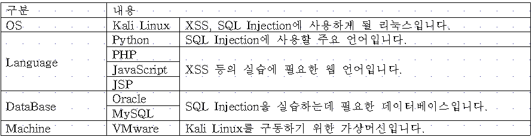
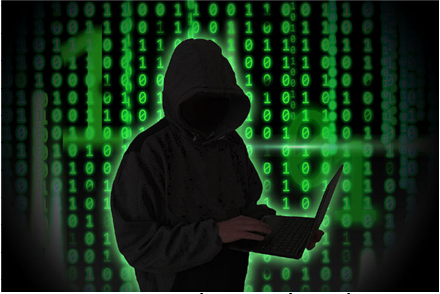
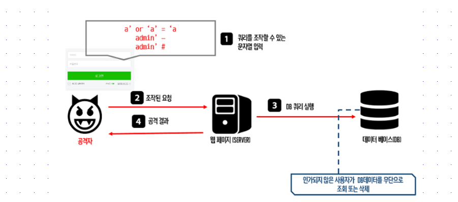
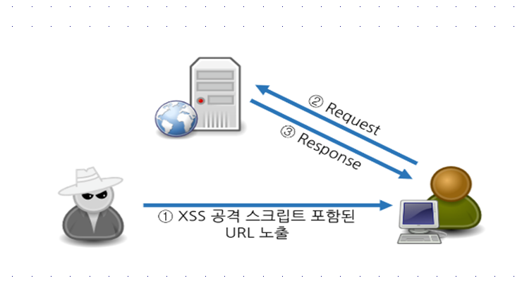
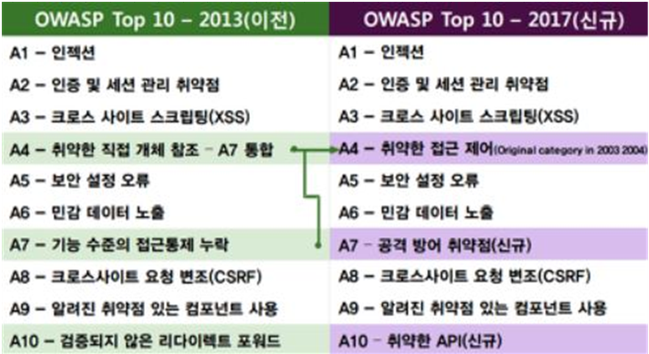
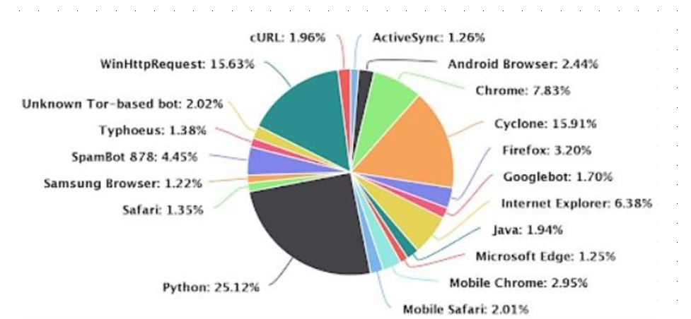
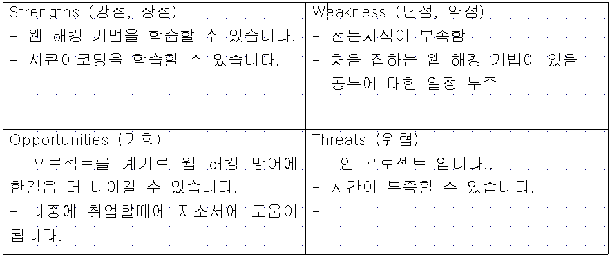
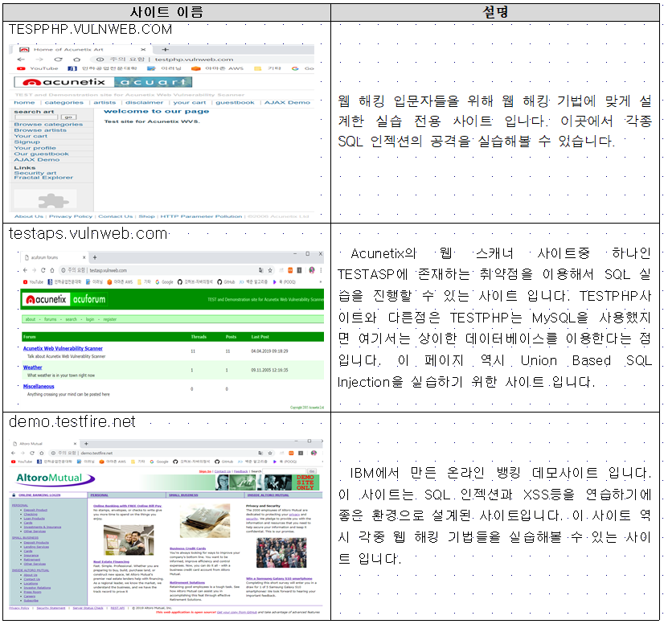

# sql-injection-project

### 개발 환경

### 프로젝트 목적

오늘날 IT의 급속한 발전으로 인하여 전세계 사람들이 편리하게 살아가고 있습니다. 은행을 방문하지 않아도 집에서 모든 금융거래를 할 수 있고, 물건도 집에서 마우스 클릭 몇 번만으로 주문하고 배달까지 가능한 시대입니다. 
  아니, 이제는 4차 산업 혁명이라고 해서 자율주행차도 나오는 시대가 되었습니다. 사람이 운전하지 않아도 자동차가 스스로 운전자가 원하는 목적지까지 알아서 운전을 해주죠. 물론 이렇게 좋은 기능들만 발전해서 사람들이 살아갈 수 있다면 세상을 살아가는게 정말 행복하고 편리하겠지만, IT와 연관된 곳 어디라면 빠지지 않는것이 바로 “해킹”입니다. PC는 물론이고 최근 10년 사이에 급격히 발전한 모바일도 예외는 아닙니다. “범죄 위협을 가하는 주체의 대부분은 상용/오픈소스 툴을 활용 한다”라며, 선택할 수 있는 툴이 많은 탓에 자체 툴을 개발할 필요가 없기 때문이라고 설명할수 있습니다.
  
### 프로젝트 목표

SQL Injection은 웹 해킹 기법중 가장 널리 알려진 공격입니다. 전에 ppt에서 설명하였듯이, OWASP TOP10 2014, 17년도에서도 보면 가장 많은 해커들이 이 SQL Injection을 통하여서 공격을 합니다. 저의 플랜B도 SQL Injection에 대하여 공부해 보는 것이기 때문에 도움이 많이 될 것 같습니다. SQL Injection은 가장 많이 쓰는 정상적인 웹 시스템에서 악의적인 SQL을 삽입하여 해커가 원하는 정보를 데이터베이스로부터 탈취해가는 기법 입니다. 이 해킹 기법으로 인해서 많은 피해가 계속해서 발생하고 있습니다. 저는 이 실습을 통해 SQL인젝션의 공격 기법을 익히고, 이에 대비하는 방법은 어떤 것 인지를 공부하고 SQL Injection의 종류에는 어떤 것들이 존재하며 이 공격들을 방어하기 위해서는 어떻게 하면 되는지를 자세히 공부하려고 합니다. 

### 프로젝트 목표

SQL Injection과 더불어 많이 알려진 XSS(Cross Site Scripting)공격 입니다. XSS의 원리는 오른쪽 그림에 나와있듯, 개인 사용자가 로그인을 하면 XSS에 의해서 사용자의 정보가 정상적으로 보내지지 않고 크래커의 서버로 보내지게 되고, 공격자는 자신의 서버로부터 정보를 탈취하는 방식입니다. 이번 실습을 통해서 XSS뿐만 아니라 CSRF(Cross Site Request Forgery)라는 공격까지 모두 살펴보도록 하겠습니다.

### OWASP TOP 10

OWASP TOP 10을 보면 알 수 있듯, 인젝션 공격은 보안에 관심이 있고, 보안을 공부한다면 반드시 알고 넘어가야 하는 핵심적인 공격법 입니다. 따라서 이번 실습에서는 다른 부분보다도 인젝션 공격은 모든 종류의 공격 기법들을 살펴보고 실습하는 방향으로 진행하도록 하겠습니다.
  그리고 이 실습의 궁극적인 목표는 제가 이 공격 기법들을 잘 파악하고 익혀서 나중에 취업을 하였을 때에도 사이트의 취약점을 면밀히 분석할 수 있고 그에 대해 해결 방안을 제시할 수 있도록 하는 것이 가장 큰 목표이며, 이 지식을 토대로 다른 사람에게 웹 취약점과 그 위험성에 대해서 자신 있게 설명할 수 있는것을 두번째 목표로 정했습니다.

### 프로젝트 기대효과

이번 프로젝트를 통하여 이력서에 제가 정보보안을 위해서 어떠한 공부를 했고, 정보보안의 기본적인 틀을
잡고 있다는 것을 보여주기에 충분할 것 같습니다. 이번 프로젝트는 저의 미래에 한걸음 내딛게 해주고
또한 처음이라 많이 부족하지만, 앞으로의 일에서 충분히 자신감을 가지고 임할수 있을 것입니다.
사실 정확하게 어느 분야로 갈지는 확신이 잘 들지 않습니다. 하지만 2학년 2학기에는 웹 프로젝트를 진행하면서 웹쪽을 공부해보면서 많은 것을 알았고, 이번에는 보안 프로젝트를 진행함으로써 다양한 보안쪽과 보안쪽과 관련한 언어로는 파이썬이 25.12퍼센트로 가장 높습니다. 따라서 웹 프로젝트를 진행하였을 때에는 Jsp와 mysql을 공부하였지만, 이번 프로젝트 때에는 리눅스를 공부하여서 실력을 증진 시킬 계획입니다.

### SWOT 분석

○ Strengths(강점, 장점)
  이번 실습을 통해서 저는 각종 웹 해킹 기법들에 대해서 공부합니다. 해당 기법들을 공부하고 실습하면서 웹 해킹 공격들에 대해서 어떻게 방어를 해야하는지를 중점적으로 학습할 수 있기 때문에 많은것을 배울 수 있다는 장점이 있습니다. 또한 시큐어코딩을 처음 접해봄으로써 앞으로 근무할 환경에서 사용할 시큐어코딩에 대해서 배울 수 있습니다.

○ Weakness(단점, 약점)
 파이썬 개발경험이 없기 때문에 파이썬을 사용하는 과정에서 많은 어려움이 있을것으로 예상됩니다. 파이썬의 기초지식을 다루는것이 아닌, 파이썬의 많은 부분들 다루어야 하기 때문에 어려움이 있습니다.
  많이 들어본 웹 해킹 기법들도 있지만 완전히 처음 들어보는 해킹 기법들도 있습니다. 이름조차 생소한 웹 해킹 기법들이기 때문에 알아가는데 시간이 걸릴것으로 생각됩니다.
○Opportunities(기회)
  해당 프로젝트를 마무리한 시점에서 저는 웹 해킹기법들의 공격법을 이해하고 방어하려면 어떻게 해야하는지 알게 됩니다. 이러한 지식을 바탕으로 면접시 자신있게 제가 알고있는 내용으로 어필할 수 있습니다. 또한 보안에 대해서 잘 알지 못하는 사람들에게 보안의 중요성과 필요성에 대해서 알려주고 대비책을 어떻게 세워야 하는지 조언을 해줄 수 있습니다.

○Threats(위협)
  우선 이 프로젝트는 1인 프로젝트로 진행합니다. 따라서 모든 정보 수집과 실습을 혼자 해결해 나아가야 하기 때문에 중요한 포인트를 놓치는 부분도 생길 수 있고, 개인적으로 자격증공부 3개와 전공학점 24학점의 수업을 병행하며 작업해야 하기 때문에 시간적으로 많은 압박이 있습니다.
  저의 프로젝트는 기존의 해킹기법들에 대해 책으로 실습하고 실제 페이지에 적용하는 것입니다. 따라서 신종으로 생겨나는 해킹기법에 대해서는 학습하지 못하기 때문에 이러한 부분에 대해서는 알지 못하고 넘어가게 됩니다.

### 온라인 환경

